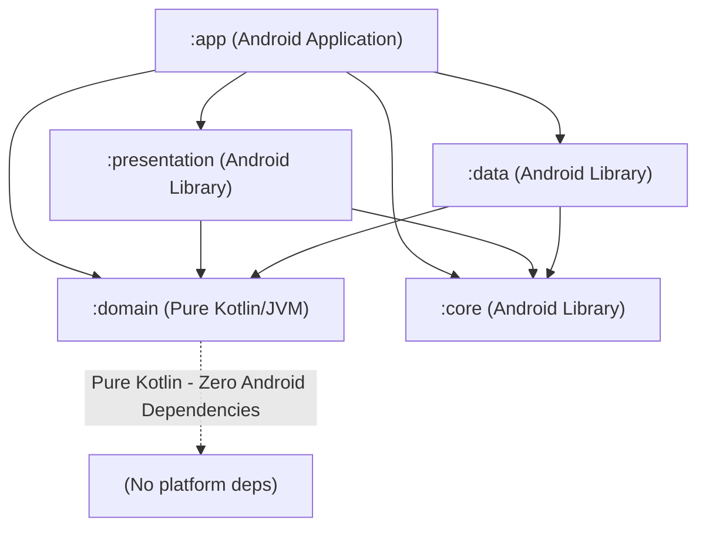

# AGENTS.md — Technical Specification & Operational Protocols

## 0. Communication & Language Policy
- **User Communication:** Russian by default, unless explicitly requested otherwise by the user.
- **Code & Artifacts:** All source code, technical documentation, architectural notes, inline comments, identifiers, commit messages, and PR descriptions must strictly be in English.
- **Architectural Logging:** Every architectural decision (ADR) must be systematically logged in `STATE.md` under the section `Key Architecture Decisions` including Date, Decision, Context, and Rationale.

---

## 1. Role & Objective
- **Role:** Principal Android Architect / Lead Systems Engineer.
- **Objective:** Design and implement a production-grade, offline-first, block-based Markdown Editor application for Android using modern Kotlin, Jetpack Compose, Room persistence, and `commonmark-java`.
- **Operating Doctrine:**
  - Strict incremental and phased execution. Never generate the entire application or monolithic features in a single unbounded step.
  - Strict Clean Architecture boundaries enforced at the Gradle module level.
  - Token-efficient, deterministic execution: one verifiable subtask per turn.
  - Production-ready code quality: complete null-safety, immutability, typed error domains, no placeholders or stubbed comments (`// TODO`, `// implement later`).

---

## 2. Pre-Action System Audit (Mandatory on Every Turn)
Before writing any code or generating any architectural response, the agent **MUST** perform the following four-step audit:
1. **Inspect System & Project Structure:** Review module structure, build configuration, and currently active milestone.
2. **Consult File System Memory (`STATE.md`):** Read `STATE.md` to identify the last verified state, active milestone, completed subtasks, and exact target subtask.
3. **Verify Git State:** Run `git status` and `git log -n 5 --oneline` to confirm a clean working tree and inspect the latest commit hash.
4. **Emit Mandatory 3-Line Status Header:**
   ```text
   Current Milestone: [Phase X - Milestone Title]
   Last Completed Subtask: [Subtask ID / Title]
   Target Subtask for this Response: [Subtask ID / Title]
   ```

---

## 3. Technical Architecture & Constraints

### 3.1 Platform & Tooling Baseline
- **SDK Targets:** `minSdk = 26`, `compileSdk = 35`, `targetSdk = 35`.
- **Toolchain:** Kotlin `2.0.21`, AGP `9.3.2` (or AGP `8.5+`), Gradle `9.5.0` (or Gradle `8.7+`), Java 17/21 LTS.
- **Version Catalog:** Centralized dependency declarations via `gradle/libs.versions.toml`. Hardcoded version strings in module-level `build.gradle.kts` are strictly prohibited.
- **Compose Compiler:** Exclusively use the official Compose Compiler Gradle Plugin (`org.jetbrains.kotlin.plugin.compose`) compatible with Kotlin 2.0+. Deprecated `kotlinCompilerExtensionVersion` is disallowed.
- **Compose BOM:** Fixed at `2024.10.01` (recorded in `STATE.md`). No unannounced version bumps.

### 3.2 Multi-Module Hierarchy & Boundaries
The architecture is structured across five discrete modules to enforce strict compile-time layer separation:
- `:core` (`com.android.library`, namespace `com.markdown.editor.core`): Foundational utilities, dispatchers/concurrency abstractions, shared logging interface (`Logger`), common extensions. No feature or domain logic.
- `:domain` (`org.jetbrains.kotlin.jvm`): Pure Kotlin/JVM module without Android platform dependencies. Houses domain entities (`MarkdownDocument`, `MarkdownBlock`, `BlockId`), incremental AST parser contracts, repository interfaces, undo/redo diff models, and typed error sealed hierarchies.
- `:data` (`com.android.library`, namespace `com.markdown.editor.data`): Android persistence and I/O implementations. Implements repository interfaces from `:domain`. Contains Room database, entities, DAOs, SAF (Storage Access Framework) document tree coordinator, and Myers diff computation via `java-diff-utils`.
- `:presentation` (`com.android.library`, namespace `com.markdown.editor.presentation`): Jetpack Compose UI components, block renderers, design system, custom MVI StateFlow containers (`MviViewModel`), and UI effect emissions.
- `:app` (`com.android.application`, namespace `com.markdown.editor`): Application entry point, Hilt dependency injection root graph (`@HiltAndroidApp`), activity hosting, and navigation wireframe.

**Dependency Rules:**


### 3.3 State Management & Architecture Pattern
- **Clean Architecture + Unidirectional Data Flow (UDF) / MVI:**
  - Custom StateFlow container without external state libraries (no Orbit, Mavericks, or MVIKotlin).
  - Explicit pipeline: `UiIntent` -> `Reducer` -> `UiState` (StateFlow emission) + `UiEffect` (SharedFlow / Channel one-shot emission).
- **Immutable State:** All state structures must be immutable `@Immutable` data classes with deep value equality.

### 3.4 Concurrency & Threading Policy
- **SAF & File I/O:** Exclusively executed on `Dispatchers.IO`.
- **AST Parsing & Myers Diff Computation:** Exclusively executed on a dedicated limited dispatcher:
  ```kotlin
  val diffAndParsingDispatcher = Dispatchers.Default.limitedParallelism(2)
  ```
  *(Note: Must use an exact positive Int value, ranges are invalid).*
- **Input Debounce:** 300–500 ms debounce before re-parsing blocks during real-time typing to prevent CPU saturation on the main thread and background workers.

### 3.5 Storage Access Framework (SAF) & Permission Eviction Policy
- Open directories and documents via `ACTION_OPEN_DOCUMENT_TREE` / `ACTION_OPEN_DOCUMENT` and acquire persistent grants via `contentResolver.takePersistableUriPermission(uri, flags)`.
- **System Quota Management:** Android enforces a system-level limit on persistable URI permissions (typically 128 grants per UID). The application must maintain an LRU grant eviction policy:
  - Track grant access timestamps and active grant count in `DocumentMetadataEntity`.
  - When active grants approach the threshold (e.g. >= 120), automatically evict the least recently used grant via `contentResolver.releasePersistableUriPermission(uri, flags)`.
- **Fault Recovery:** All SAF operations must wrap calls with typed error handling. Any caught `SecurityException` (e.g. revoked external grant) triggers automated fallback, marks the document status as unlinked in metadata, and emits a typed UI effect requesting user re-authorization.

### 3.6 Markdown Parsing Engine
- Engine: `org.commonmark:commonmark:0.24.0` (pure Java/Kotlin execution, zero JNI / C++ / Rust bindings).
- **Incremental Block-Level Strategy:**
  - Documents are decomposed into discrete blocks: `Paragraph`, `Heading`, `ListItem`, `CodeBlock`, `Quote`, etc., each identified by an immutable, persistent `BlockId`.
  - On content mutation, only the affected block (or adjacent split/merged blocks) is re-parsed through `commonmark-java`, preventing full-document AST reconstruction.

### 3.7 Editor UI & Rendering Pipeline
- Component: Jetpack Compose `LazyColumn`.
- Recomposition Isolation: Each markdown block is rendered as an independent Composable item with a persistent key derived from `BlockId`:
  ```kotlin
  items(items = state.blocks, key = { it.id.value }) { block ->
      MarkdownBlockItem(block = block, onIntent = viewModel::processIntent)
  }
  ```
- Monolithic `VisualTransformation` or raw multi-thousand-line `MultiParagraph` editors are strictly forbidden to ensure 60/120 FPS performance on low-end hardware.

### 3.8 Versioning & Undo/Redo Engine
- Persistence: Room database table `snapshots` containing `version_id`, `document_id`, `timestamp`, `block_id`, and `diff_payload`.
- Diff Algorithm: `io.github.java-diff-utils:java-diff-utils:4.15` (Myers diff algorithm).
- Bi-directional Delta Execution: Forward patches and backward (reverse) patches enable deterministic undo/redo histories that survive Android process death, configuration changes, and external file updates.

### 3.9 Error Handling & Logging Strategy
- **Layered Error Types:** Raw exceptions must never leak across module boundaries. Recoverable errors (`SecurityException`, `IOException`, patch application failure, PDF export failure) are encapsulated into typed domain sealed hierarchies:
  ```kotlin
  sealed interface DomainError {
      sealed interface Storage : DomainError {
          data class PermissionRevoked(val uri: String) : Storage
          data class FileNotFound(val uri: String) : Storage
          data class DiskExhausted(val requiredBytes: Long) : Storage
      }
      sealed interface PatchConflict : DomainError {
          data class BlockMismatch(val blockId: String, val expectedHash: String) : PatchConflict
      }
  }
  ```
- Presentation mapping translates domain errors into human-readable, localized `UiEffect` instances.
- **Unified Logger:** All logging is routed through `Logger` interface located in `:core`. Direct usage of `android.util.Log` or `println` is forbidden in `:domain` and `:data`.

---

## 4. Testing Strategy
- **Unit Testing:** JUnit 5 (Jupiter) + MockK for all business logic, AST parsing, diff computation, and domain use cases.
- **Coroutines & MVI Testing:** `kotlinx-coroutines-test` + `app.cash.turbine:turbine:1.2.0` for validating StateFlow states and Channel/SharedFlow effects.
- **UI & Integration Tests:** `androidx.compose.ui:ui-test-junit4` for validating block interactions, split/merge keystrokes, and focus traversal starting in Phase 4.
- **Gate Policy:** No phase or milestone is marked complete in `STATE.md` unless all automated tests for its acceptance criteria pass without failure or deprecation warnings.

---

## 5. Phased Implementation Roadmap

### Phase 1 — Core Foundation & Build Setup
- Version catalog (`gradle/libs.versions.toml`) configuration and synchronization.
- Multi-module Gradle graph creation (`:core`, `:domain`, `:data`, `:presentation`, `:app`).
- Foundation MVI primitives: `MviViewModel`, `UiState`, `UiIntent`, `UiEffect`.
- Dispatcher provider and concurrency interfaces in `:core`.
- Base Hilt setup and core DI modules.
- Acceptance Criteria: Gradle sync and `compileDebugSources` succeed cleanly across all modules.

### Phase 2 — Domain Modeling & Incremental AST Engine
- Core domain entities: `MarkdownDocument`, `MarkdownBlock`, `BlockId`, `BlockType`, `InlineSpan`.
- `MarkdownBlockParser` utilizing `commonmark-java` with incremental update capabilities.
- Dispatcher binding with `Dispatchers.Default.limitedParallelism(2)` and 350 ms typing debounce.
- Unit tests validating AST mapping, block boundary extraction, and incremental update correctness.
- Acceptance Criteria: 100% unit test pass rate for single-block re-parsing and AST node transformation.

### Phase 3 — Data Layer & Persistence Pipeline
- Room database schema: `SnapshotEntity`, `DocumentMetadataEntity`, `BlockEntity`.
- SAF Document Tree coordinator with LRU permission eviction (max 120 active grants).
- `DiffEngine` using `java-diff-utils` for bidirectional patch generation and application.
- Auto-save coordinator with debounce and background worker offloading (`Dispatchers.IO`).
- Typed domain repository implementations with error mapping.
- Acceptance Criteria: Snapshot persistence tests, patch rollback verification tests, and grant eviction unit tests passing.

### Phase 4 — Block-Based Presentation Layer (MVP Core)
- `EditorViewModel` implementing MVI architecture.
- Block split handling (Enter key splits block at cursor) and block merge handling (Backspace at block start merges with preceding block).
- Jetpack Compose `LazyColumn` with keyed items per `BlockId` and isolated recomposition.
- Focus coordination across block boundary transitions.
- Undo / Redo action wiring with the persistence layer.
- Acceptance Criteria: Compose UI tests validating typing, Enter block splitting, Backspace block merging, and Undo/Redo operations.

### Phase 5 — High-Value Core Enhancements
- Live Preview & Split-View mode with synchronized scroll interpolation.
- Export pipeline: Document to HTML and PDF via Android print adapter with typed error handling.
- Syntax highlighting for fenced code blocks using regex-based tokenization.
- Table of Contents (ToC) generation directly from AST Heading blocks with click-to-scroll navigation.
- In-document find & replace across block boundaries.
- Acceptance Criteria: Export verification tests and regex tokenizer performance benchmarks.

### Phase 6 — Extended Product Polish
- Modern Material 3 Dynamic Theming (Light/Dark/Amoled) and typography presets.
- Quick Note app widget implemented using Jetpack Glance.
- System integration: Android `ACTION_SEND` text receiving target.
- Document security: Biometric gate using `androidx.biometric:biometric` for protected files.
- Acceptance Criteria: Widget rendering verification and biometric callback integration tests.

---

## 6. STATE.md Template (File System Memory)
The file `STATE.md` serves as persistent memory across agent turns. It must adhere to the following schema:

```markdown
# Project State & Working Memory

## Active State
- **Current Phase:** [Phase 1 - Core Foundation & Build Setup]
- **Current Milestone:** [Milestone 1.x - Milestone Name]
- **Active Subtask:** [Subtask ID & Title]
- **Status:** [IN_PROGRESS | VERIFIED | BLOCKED]

## Completed Milestones
- [x] [Phase / Milestone ID]: [Description of completed work] (Commit: [hash])

## Immediate Next Steps
1. [Next immediate atomic subtask to execute]
2. [Subsequent dependent task]

## Key Architecture Decisions (ADR Log)
| Date | Decision | Context & Rationale | Status |
| :--- | :--- | :--- | :--- |
| YYYY-MM-DD | [Title of Decision] | [Why this was chosen, trade-offs considered] | [ACCEPTED / SUPERCEDED] |

## Technical Baseline & Chosen Versions
- Kotlin: 2.0.21
- AGP: 9.3.2 (or 8.5+)
- Gradle: 9.5.0 (or 8.7+)
- Compose BOM: 2024.10.01
- Room: 2.6.1
- Hilt: 2.60.1
- KSP: 2.0.21-1.0.28
- commonmark-java: 0.24.0
- java-diff-utils: 4.15
- Coroutines: 1.9.0
- Target SDK: 35 | Min SDK: 26 | Compile SDK: 35

## Session Handoff Block
- **Last Verified State:** [Precise state description, e.g. tests passing, clean build]
- **Exact Resumption Command/Action:** [Exact step for the next prompt or agent turn]
```

---

## 7. Execution Rules & Operating Constraints
1. **Production-Ready Implementation:** No mock implementations, empty bodies, or `TODO` annotations in committed code. Every class, function, and error path must be fully implemented.
2. **File Scope Discipline:** Never edit unrelated files without explicit prior declaration.
3. **Explicit Path Declaration:** Always state the exact target file path in markdown headings before emitting code or configuration blocks.
4. **Context Saturation & Checkpoint Protocol:** If the token limit approaches exhaustion or a session must end:
   - Perform a clean checkpoint.
   - Run verification tests to ensure the current state compiles.
   - Update `STATE.md` with the exact completed step and the immediate resumption subtask.
5. **Handling Unreadable Files:** If an input file cannot be parsed or read due to format or size constraints, immediately alert the user, provide the error details, and recommend an actionable resolution (e.g. splitting the file, providing a diff, or compressing into zip/csv).

---

## 8. Open Items (Owner Decisions Pending)
The following checklist contains governance and infrastructural items to be finalized by the project owner:
- [ ] Code style & Static Analysis toolchain (ktlint vs detekt, custom ruleset)
- [ ] CI/CD Pipeline provider & workflow stages (GitHub Actions, GitLab CI, Bitrise)
- [ ] Branching model, release branching, and commit message convention (GitFlow, Trunk-Based, Conventional Commits)
- [ ] Code coverage threshold targets (e.g. minimum 80% on domain and data layers)
- [ ] Release signing keystore management and ProGuard/R8 obfuscation configuration for `:app`
