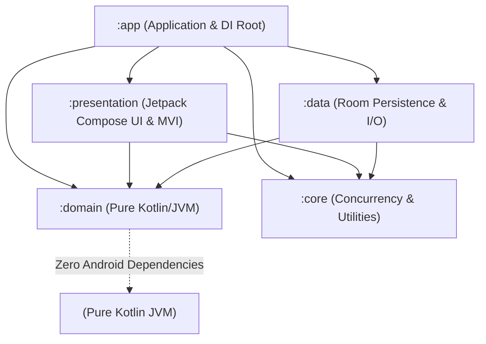

# Contributing to Markdown Editor

Thank you for your interest in contributing to **Markdown Editor**! We welcome contributions that align with our architectural standards, code quality benchmarks, and product roadmap.

---

## 🏛️ Architectural Principles & Layer Boundaries

Markdown Editor is strictly structured around **Clean Architecture** and **Unidirectional Data Flow (UDF / MVI)** across five discrete Gradle modules:



### Module Dependency Rules
1. **`:domain` (Pure Kotlin/JVM):**
   - Must contain **zero Android SDK dependencies** (`com.android.*` or `android.*`).
   - Houses domain entities (`MarkdownDocument`, `MarkdownBlock`, `BlockId`), incremental AST parser contracts, repository interfaces, use cases, and typed error sealed hierarchies (`DomainError`).
2. **`:core` (Android Library):**
   - Foundational abstractions: `DispatcherProvider`, `Logger`, shared extensions.
   - Must not depend on any feature or domain logic.
3. **`:data` (Android Library):**
   - Implements repository interfaces from `:domain`.
   - Houses Room database, DAOs, entities, Storage Access Framework (SAF) coordinator, multi-format converters (`.docx`, `.xlsx`, `.pdf`, `.html`, `.csv`), and Myers diff computation via `java-diff-utils`.
4. **`:presentation` (Android Library):**
   - Jetpack Compose UI, Material 3 theming, block renderers, `MviViewModel`, and UI effects.
   - Each Markdown block is rendered as an independent Composable item keyed by `BlockId` in `LazyColumn`.
5. **`:app` (Android Application):**
   - Application entry point (`MarkdownApplication`), Hilt dependency injection root graph, activity hosting, and navigation drawer.

---

## 🛡️ Code Quality & SonarCloud Benchmarks

All code submitted to this repository must meet strict production quality standards:
- **Cognitive Complexity:** Must be strictly **less than 15** per function (`kotlin:S3776`). Break complex algorithms into small, single-purpose private helper functions.
- **Parameter Count:** Functions must not exceed **7 parameters** (`kotlin:S107`). Group related parameters into value classes or data bundles.
- **Production-Ready Implementation:** No stubbed comments (`// TODO`, `// implement later`) or mock implementations in production paths.
- **Layered Error Handling:** Never leak raw exceptions across module boundaries. Encapsulate recoverable errors into typed `DomainError` sealed hierarchies.
- **Unified Logging:** Use the `Logger` interface from `:core`. Direct usage of `android.util.Log` or `println` is prohibited in `:domain` and `:data`.

---

## 🌿 Git & Commit Workflow

### Branching Convention
- `feature/<feature-name>` for new functionality.
- `fix/<bug-name>` for bug fixes and stability improvements.
- `refactor/<scope>` for code refactoring and performance tuning.

### Commit Messages
We follow the **Conventional Commits** specification:
- `feat: add Google ML Kit on-device document scanner`
- `fix: resolve cursor jumping during rapid markdown typing`
- `refactor: extract table conversion logic into dedicated helper`
- `docs: update architecture overview in README`
- `test: add unit test coverage for pdf heading heuristics`

---

## 🧪 Verification & Local Testing

Before submitting a Pull Request, run the local verification suite to ensure all tests and builds pass:

```bash
# Run unit tests across all modules
.\gradlew testDebugUnitTest :domain:test

# Verify debug APK compilation
.\gradlew assembleDebug

# Verify production release build with R8 optimization
.\gradlew assembleRelease
```

---

## 📬 Submitting a Pull Request (PR)

1. Fork the repository and create your branch from `main`.
2. Ensure your code compiles cleanly without compiler warnings.
3. Add unit tests for any new business logic, parsers, or use cases.
4. Verify that existing tests pass (100% pass rate).
5. Open a Pull Request with a clear description of the problem solved, design decisions, and screenshots/GIFs for UI changes.
