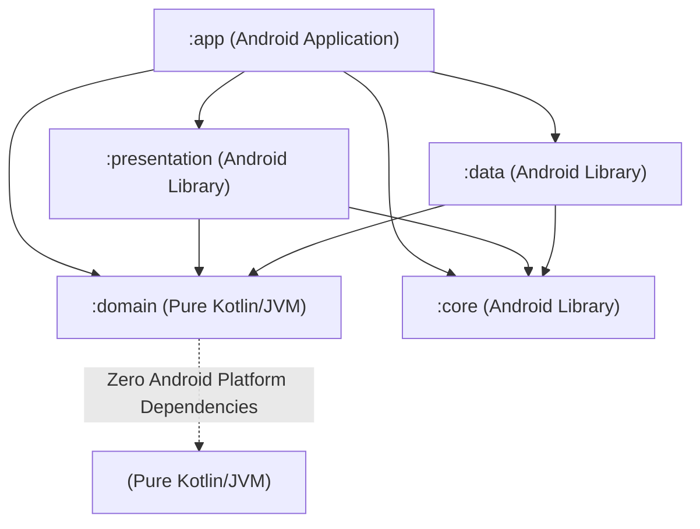

# Markdown Editor for Android

[](https://kotlinlang.org)
[](https://developer.android.com)
[](https://developer.android.com/jetpack/compose)
[](#-architecture--layer-separation)
[](./LICENSE)
[](https://sonarcloud.io)
[](#-ai-assisted-engineering--transparency-self-declaration)

A production-grade, offline-first, block-based **Markdown Editor** application for Android built with modern Kotlin, Jetpack Compose, Room persistence, and `commonmark-java`. Designed for high performance, smooth 60/120 FPS scrolling, granular block-level editing, multi-format document conversion, on-device OCR scanning via Google ML Kit, and biometric security.

---

## ✨ Key Features

### 🧱 Block-Based Editing Engine
- **Granular Recomposition:** Decomposes Markdown documents into discrete blocks (`Paragraph`, `Heading`, `CodeBlock`, `Quote`, `ListItem`, `ThematicBreak`), each rendered as an independent Composable item keyed by an immutable `BlockId` in a `LazyColumn`.
- **Fluid Keyboard Gestures:** Pressing `Enter` cleanly splits a block at the exact cursor position with smart list (`- `, `1. `) and quote (`> `) continuation. Pressing `Backspace` at the start of a block merges it with the preceding block with seamless focus traversal.
- **Accessory Keyboard Bar:** Docked Markdown formatting toolbar above the soft keyboard (`imePadding()`) for instant syntax insertion without manual symbol typing.

### 🔍 Google ML Kit On-Device Text Recognition (OCR)
- **On-Device Optical Character Recognition:** Capture or import images and document scans directly into Markdown blocks via **Google ML Kit Text Recognition v2**.
- **Heuristic AST Structuring:** Automatically analyzes line spacing, capitalization, and numeric/bullet sequences to convert raw bounding boxes into headings, bullet lists, and paragraphs.
- **Zero Cloud Latency & Privacy:** Completely offline processing with on-device models delivered dynamically by Google Play Services, adding zero APK bloat (~16.5 MB release APK).

### 📊 Interactive Mermaid Diagrams
- **Live Diagram Preview:** Render ````mermaid fenced code blocks into dynamic vector diagrams (flowcharts, sequence diagrams, state diagrams, class diagrams, Git graphs, and ER diagrams) in Live Preview.
- **Dual-Mode Inspection:** Seamless one-tap toggle between visual diagram view and raw source code with copy support.
- **Dynamic Theme Synchronization:** Automatic color palette adaptation for Material 3 Light and Dark/AMOLED modes.

### 👁️ Live Preview & Synchronized Split-View
- **Responsive Dual-Pane Mode:** Side-by-side editing and preview on wide screens/tablets; stacked layout on compact mobile devices.
- **Bidirectional Scroll Synchronization:** Loop-free scroll coordinator (`rememberSynchronizedScroll`) keeping editor and preview viewports perfectly aligned.
- **Rich Markdown Formatting:** Inline rendering for bold, italic, strikethrough, inline code, links, blockquotes, and thematic breaks.

### 🔐 Biometric Document Protection
- **Hardware-Grade Security:** Protect sensitive notes using `androidx.biometric:biometric-ktx` supporting `BIOMETRIC_STRONG` (fingerprint, face unlock) and system device credentials (PIN, pattern, password).
- **Instant Session Locking:** Tap "Lock Note Now" in the top bar to immediately secure the active session into `LockedDocumentView`.
- **Automatic Background Relock:** Secured documents automatically relock whenever the application is sent to the background (`Lifecycle.Event.ON_STOP`).

### 🔄 Multi-Format Document-to-Markdown Converter
- **Microsoft Word (`.docx`):** Parses OpenXML ZIP archives into headings, formatted text, lists, and Markdown tables.
- **Microsoft Excel (`.xlsx`):** Reads shared strings and worksheet cells into clean Markdown tables.
- **Adobe PDF (`.pdf`):** Extracts text structure with heuristic heading size detection and font style recognition via `pdfbox-android` (strictly pure-text, zero graphics decoding overhead).
- **Web HTML (`.html`, `.htm`):** Cleans and transforms DOM trees into clean Markdown via JSoup.
- **Tabular Data (`.csv`, `.tsv`):** Parses delimited files including multiline quoted fields into Markdown tables.
- **Structured Code (`.json`, `.xml`, `.yaml`):** Imports structured data directly into fenced code blocks with appropriate syntax tags.
- **Universal Binary Protection:** Null-byte buffer sniffing (`content.take(4096).contains('\u0000')`) and media extension blacklisting prevent corrupt binary imports.

### ⏪ Myers Diff Snapshot Engine
- **Deterministic Undo/Redo:** Forward and reverse deltas computed via `java-diff-utils` and persisted in Room across process deaths and configuration changes.
- **Debounced Auto-Save:** Background persistence offloaded to `Dispatchers.IO` and `limitedParallelism(2)` dispatcher with 300 ms typing debounce.

### 🖨️ Export & System Sharing
- **Export to HTML & PDF:** Generates standalone responsive HTML with print media stylesheets or prints/exports to PDF using Android's native `PrintManager`.
- **System Intent Handlers:** Accepts shared text or files via `Intent.ACTION_SEND` and opens files via `Intent.ACTION_VIEW` for markdown, plain text, and PDF files.
- **Quick Note Home Screen Widget:** Glance-powered widget (`androidx.glance:glance-appwidget:1.1.1`) for 1-tap note creation and access from your home screen.

---

## 🏛️ Architecture & Layer Separation

Markdown Editor strictly adheres to **Clean Architecture** and **Unidirectional Data Flow (UDF / MVI)** across five Gradle modules:



### Module Breakdown

| Module | Type | Responsibilities |
| :--- | :--- | :--- |
| **`:domain`** | Pure Kotlin/JVM | Entities (`MarkdownDocument`, `MarkdownBlock`, `BlockId`), incremental AST parser contracts, repository interfaces, use cases, typed error sealed hierarchies (`DomainError`). Zero Android dependencies. |
| **`:core`** | Android Library | Concurrency abstractions (`DispatcherProvider`), unified logging (`Logger`), shared utilities. |
| **`:data`** | Android Library | Room database, DAOs, entities, Storage Access Framework (SAF) tree coordinator, multi-format converters (`.docx`, `.xlsx`, `.pdf`, `.html`, `.csv`), Myers diff computation via `java-diff-utils`. |
| **`:presentation`** | Android Library | Jetpack Compose UI, Material 3 theming, block renderers, `EditorViewModel` (MVI StateFlow container), UI effect emissions. |
| **`:app`** | Android Application | Application entry point (`MarkdownApplication`), Hilt dependency injection root graph, activity hosting, and navigation drawer. |

---

## 🛠️ Technology Stack & Dependencies

All dependencies are centrally managed via Version Catalog ([`gradle/libs.versions.toml`](./gradle/libs.versions.toml)):

| Technology / Library | Version | Purpose |
| :--- | :--- | :--- |
| **Kotlin** | `2.4.20` | Primary language with Compose Compiler plugin |
| **Android Gradle Plugin** | `9.4.0` | Build toolchain |
| **Gradle** | `9.7.1` | Build system |
| **Jetpack Compose BOM** | `2026.09.00` | Declarative UI framework |
| **Room** | `2.8.5` | Local persistence and snapshot database |
| **Dagger Hilt** | `2.60.1` | Dependency injection |
| **Google ML Kit Text Recognition** | `19.0.1` | On-device OCR scanning into Markdown |
| **Mermaid.js** | `11.4.1` | Vector diagram rendering in Live Preview |
| **commonmark-java** | `0.30.0` | Markdown AST parsing and HTML generation |
| **java-diff-utils** | `4.17` | Myers diff algorithm for bidirectional undo/redo deltas |
| **pdfbox-android** | `2.0.27.0` | PDF text and structure extraction |
| **jsoup** | `1.18.3` | HTML parsing and DOM manipulation |
| **androidx.biometric** | `1.2.0-alpha05` | Biometric authentication (fingerprint/face/credentials) |
| **Jetpack Glance** | `1.1.1` | Home screen AppWidget |
| **Turbine** | `1.2.1` | Coroutines Flow testing |
| **Target / Compile SDK** | `37` (Android 15+) | Minimum SDK: 26 (Android 8.0) |

---

## ⚡ Getting Started

### Prerequisites
- **JDK:** OpenJDK 21 (LTS) installed and `JAVA_HOME` configured.
- **Android SDK:** Platform API 37 and Build-Tools installed.
- **Android Studio:** Ladybug (or newer recommended).

### 1. Clone the Repository
```bash
git clone https://github.com/NurikBM/Markdown-Editor.git
cd Markdown-Editor
```

### 2. Configure SDK Location
Create a `local.properties` file in the project root:
```properties
# Windows:
sdk.dir=C:\\Users\\<Username>\\AppData\\Local\\Android\\Sdk

# macOS / Linux:
sdk.dir=/Users/<Username>/Library/Android/sdk
```

### 3. Build & Run Tests
Run the deterministic build commands via the Gradle wrapper:

```bash
# Run unit tests across all 5 modules (100+ tests)
.\gradlew testDebugUnitTest :domain:test

# Compile debug APK
.\gradlew assembleDebug

# Compile optimized production release APK (R8 minification & resource shrinking)
.\gradlew assembleRelease
# Output: app/build/outputs/apk/release/MarkdownEditor-v1.0-release.apk
```

---

## 🤖 AI-Assisted Engineering & Transparency Self-Declaration

In compliance with open-source ethical disclosure standards and AI development transparency:

This repository was architected and implemented with the assistance of **Google DeepMind's Antigravity** autonomous AI pair-programming assistant powered by advanced **Google Gemini** reasoning models.

- **Human-Directed Architecture:** System architecture, multi-module boundaries, persistence strategies, and product requirements were designed, directed, and approved by the repository owner.
- **Verified Code Quality:** All code undergoes deterministic automated verification, including 100% unit test pass rates across all modules, strict compilation checks, ProGuard/R8 minification, and SonarCloud clean-code analysis (zero security vulnerabilities, low cognitive complexity, strict Clean Architecture layer separation).
- **Open Governance:** Architectural decisions are systematically recorded in [`STATE.md`](./STATE.md) (ADR log).

---

## 🤝 Contributing

We welcome contributions! Please read our [**Contributing Guide**](./CONTRIBUTING.md) for details on our code style, Clean Architecture standards, SonarCloud quality gates, and the pull request process.

---

## 📄 License & Attributions

- Distributed under the **Apache License 2.0**. See [`LICENSE`](./LICENSE) for more information.
- Third-party open-source licenses, AI self-declaration, and copyright notices are documented in [`NOTICE`](./NOTICE).
